## Overview

- **Project**: /home/tom/github/semcod/pactfix
- **Primary Language**: python
- **Languages**: python: 47, javascript: 14, shell: 9, php: 4, typescript: 2
- **Analysis Mode**: static
- **Total Functions**: 252
- **Total Classes**: 5
- **Modules**: 77
- **Entry Points**: 199

### e2e.app.spec
- **Functions**: 77
- **File**: `app.spec.ts`

### server
- **Functions**: 37
- **Classes**: 1
- **File**: `server.py`

### pactown-js.src.analyzer
- **Functions**: 33
- **File**: `analyzer.js`

### pactfix-py.pactfix.sandbox
- **Functions**: 12
- **Classes**: 1
- **File**: `sandbox.py`

### examples.nodejs.faulty
- **Functions**: 8
- **File**: `faulty.js`

### examples.nodejs.fixed
- **Functions**: 8
- **File**: `fixed.js`

### examples.nodejs.fixed.fixed_faulty
- **Functions**: 8
- **File**: `fixed_faulty.js`

### examples.nodejs.fixed.fixed_fixed
- **Functions**: 8
- **File**: `fixed_fixed.js`

### examples..pactfix.fixed.nodejs.faulty
- **Functions**: 8
- **File**: `faulty.js`

### examples..pactfix.fixed.nodejs.fixed
- **Functions**: 8
- **File**: `fixed.js`

### scripts.git_commit_helper
- **Functions**: 8
- **File**: `git_commit_helper.py`

### pactfix-py.pactfix.cli
- **Functions**: 8
- **File**: `cli.py`

### pactfix-py.pactfix.server
- **Functions**: 6
- **File**: `server.py`

### pactfix-py.pactfix.analyzers.kubernetes
- **Functions**: 6
- **File**: `kubernetes.py`

### examples.javascript.faulty
- **Functions**: 5
- **File**: `faulty.js`

### examples.javascript.fixed
- **Functions**: 5
- **File**: `fixed.js`

### examples.javascript.fixed.fixed_fixed
- **Functions**: 5
- **File**: `fixed_fixed.js`

### examples.javascript.fixed.fixed_faulty
- **Functions**: 5
- **File**: `fixed_faulty.js`

### examples..pactfix.fixed.javascript.fixed
- **Functions**: 5
- **File**: `fixed.js`

### examples..pactfix.fixed.javascript.faulty
- **Functions**: 5
- **File**: `faulty.js`

## Key Entry Points

Main execution flows into the system:

### pactfix-py.pactfix.analyzers.python_lang.analyze_python
> Analyze Python code.
- **Calls**: code.split, lines.copy, enumerate, AnalysisResult, current_line.strip, pactfix-py.pactfix.analyzers.python_lang._split_python_comment, code_part.strip, code_stripped.startswith

### pactfix-py.pactfix.analyzers.apache.analyze_apache
> Analyze Apache configuration for common issues.
- **Calls**: code.split, lines.copy, enumerate, enumerate, enumerate, AnalysisResult, line.strip, None.startswith

### pactfix-py.pactfix.analyzers.kubernetes.analyze_kubernetes
- **Calls**: code.splitlines, lines.copy, enumerate, AnalysisResult, AnalysisResult, list, re.match, doc.get

### pactfix-py.pactfix.analyzers.terraform.analyze_terraform
- **Calls**: code.splitlines, lines.copy, set, set, enumerate, AnalysisResult, line.strip, stripped.startswith

### pactfix-py.pactfix.analyzers.systemd.analyze_systemd
> Analyze systemd unit file for common issues.
- **Calls**: code.split, lines.copy, enumerate, AnalysisResult, line.strip, stripped.startswith, stripped.startswith, stripped.startswith

### pactfix-py.pactfix.analyzers.docker_compose.analyze_docker_compose
- **Calls**: code.splitlines, lines.copy, data.get, data.get, bool, enumerate, services.items, AnalysisResult

### pactfix-py.pactfix.analyzers.nginx.analyze_nginx
> Analyze nginx config.
- **Calls**: code.splitlines, lines.copy, enumerate, enumerate, None.join, sorted, AnalysisResult, line.strip

### pactfix-py.pactfix.analyzers.yaml_generic.analyze_yaml
> Analyze YAML for common issues.
- **Calls**: code.split, lines.copy, enumerate, AnalysisResult, line.strip, re.search, re.match, None.join

### pactfix-py.pactfix.analyzers.helm.analyze_helm
> Analyze Helm-related YAML/templates for common issues.
- **Calls**: code.split, lines.copy, code.lower, AnalysisResult, warnings.append, enumerate, enumerate, re.search

### pactfix-py.pactfix.analyzers.html.analyze_html
> Analyze HTML for common issues.
- **Calls**: code.split, lines.copy, enumerate, AnalysisResult, line.strip, stripped.lower, errors.append, fixed_lines.insert

### server.DebugHandler.do_POST
> Handle POST requests for code analysis.
- **Calls**: urlparse, int, self.rfile.read, int, self.rfile.read, int, self.rfile.read, self.send_error

### pactfix-py.pactfix.analyzers.css.analyze_css
> Analyze CSS for common issues.
- **Calls**: code.split, lines.copy, enumerate, AnalysisResult, line.strip, re.match, re.search, re.search

### pactfix-py.pactfix.analyzers.typescript.analyze_typescript
> Analyze TypeScript code for common issues.
- **Calls**: code.split, lines.copy, enumerate, AnalysisResult, line.strip, re.search, re.match, re.search

### pactfix-py.pactfix.analyzers.makefile.analyze_makefile
> Analyze Makefile for common issues.
- **Calls**: code.split, lines.copy, set, set, enumerate, AnalysisResult, line.strip, stripped.startswith

### pactfix-py.pactfix.analyzers.ruby.analyze_ruby
> Analyze Ruby code for common issues.
- **Calls**: code.split, lines.copy, enumerate, AnalysisResult, line.strip, re.match, stripped.startswith, None.join

### pactfix-py.pactfix.analyzers.go.analyze_go
> Analyze Go code for common issues.
- **Calls**: code.split, lines.copy, enumerate, AnalysisResult, line.strip, stripped.startswith, None.join, len

### pactfix-py.pactfix.analyzers.java.analyze_java
> Analyze Java code for common issues.
- **Calls**: code.split, lines.copy, enumerate, AnalysisResult, line.strip, re.match, re.match, re.match

### pactfix-py.pactfix.analyzers.rust.analyze_rust
> Analyze Rust code for common issues.
- **Calls**: code.split, lines.copy, enumerate, AnalysisResult, line.strip, re.search, re.search, re.search

### pactfix-py.pactfix.analyzers.csharp.analyze_csharp
> Analyze C# code for common issues.
- **Calls**: code.split, lines.copy, enumerate, AnalysisResult, line.strip, re.match, re.match, re.match

### pactfix-py.pactfix.analyzers.dockerfile.analyze_dockerfile
> Analyze Dockerfile.
- **Calls**: code.split, lines.copy, set, enumerate, AnalysisResult, line.strip, stripped.upper, upper.startswith

### pactfix-py.pactfix.analyzers.gitlab_ci.analyze_gitlab_ci
- **Calls**: code.splitlines, lines.copy, enumerate, AnalysisResult, re.match, re.search, None.join, warnings.append

### pactfix-py.pactfix.analyzers.bash.analyze_bash
> Analyze Bash script.
- **Calls**: code.split, lines.copy, enumerate, AnalysisResult, current_line.strip, re.search, re.search, None.join

### pactfix-py.pactfix.analyzers.jenkinsfile.analyze_jenkinsfile
- **Calls**: code.splitlines, lines.copy, enumerate, AnalysisResult, re.search, re.search, None.join, warnings.append

### pactfix-py.pactfix.analyzers.json_generic.analyze_json
> Analyze JSON for common issues.
- **Calls**: any, re.search, re.search, AnalysisResult, warnings.append, fixed_code.replace, fixes.append, warnings.append

### pactfix-py.pactfix.analyzers.markpact.analyze_markpact
> Analyze a markpact file by inspecting each markpact:* codeblock.

Structural checks are performed on the markpact file itself (e.g. missing
run block,
- **Calls**: list, AnalysisResult, MARKPACT_BLOCK_RE.finditer, warnings.append, AnalysisResult, m.group, warnings.append, warnings.append

### pactfix-py.pactfix.analyzers.sql.analyze_sql
> Analyze SQL.
- **Calls**: code.split, lines.copy, set, set, enumerate, AnalysisResult, line.strip, stripped.upper

### server.analyze_dockerfile
> Analyze Dockerfile for common issues and best practices.
- **Calls**: code.split, set, set, enumerate, line.strip, stripped.upper, upper_line.startswith, upper_line.startswith

### server.analyze_markdown
> Analyze Markdown by extracting fenced code blocks and analyzing each block.
- **Calls**: code.split, enumerate, None.join, server.analyze_code_multi, block_result.get, out_lines.extend, blocks.append, line.strip

### pactfix-py.pactfix.analyzers.ini_generic.analyze_ini
> Analyze INI/CFG for common issues.
- **Calls**: any, configparser.ConfigParser, AnalysisResult, warnings.append, fixed_code.replace, fixes.append, warnings.append, None.join

### pactfix-py.pactfix.analyzers.markdown.analyze_markdown
> Analyze Markdown by extracting fenced code blocks and analyzing each.
- **Calls**: code.split, enumerate, None.join, AnalysisResult, None.join, server.analyze_code, out_lines.extend, blocks.append

## Process Flows

Key execution flows identified:

### Flow 1: analyze_python
```
analyze_python [pactfix-py.pactfix.analyzers.python_lang]
```

### Flow 2: analyze_apache
```
analyze_apache [pactfix-py.pactfix.analyzers.apache]
```

### Flow 3: analyze_kubernetes
```
analyze_kubernetes [pactfix-py.pactfix.analyzers.kubernetes]
```

### Flow 4: analyze_terraform
```
analyze_terraform [pactfix-py.pactfix.analyzers.terraform]
```

### Flow 5: analyze_systemd
```
analyze_systemd [pactfix-py.pactfix.analyzers.systemd]
```

### Flow 6: analyze_docker_compose
```
analyze_docker_compose [pactfix-py.pactfix.analyzers.docker_compose]
```

### Flow 7: analyze_nginx
```
analyze_nginx [pactfix-py.pactfix.analyzers.nginx]
```

### Flow 8: analyze_yaml
```
analyze_yaml [pactfix-py.pactfix.analyzers.yaml_generic]
```

### Flow 9: analyze_helm
```
analyze_helm [pactfix-py.pactfix.analyzers.helm]
```

### Flow 10: analyze_html
```
analyze_html [pactfix-py.pactfix.analyzers.html]
```

### pactfix-py.pactfix.sandbox.Sandbox
> Docker-based sandbox for running and testing fixed code.
- **Methods**: 9
- **Key Methods**: pactfix-py.pactfix.sandbox.Sandbox.__init__, pactfix-py.pactfix.sandbox.Sandbox.setup, pactfix-py.pactfix.sandbox.Sandbox._generate_docker_compose, pactfix-py.pactfix.sandbox.Sandbox._generate_dockerignore, pactfix-py.pactfix.sandbox.Sandbox.copy_fixed_files, pactfix-py.pactfix.sandbox.Sandbox.build, pactfix-py.pactfix.sandbox.Sandbox.run, pactfix-py.pactfix.sandbox.Sandbox.test, pactfix-py.pactfix.sandbox.Sandbox.cleanup

### server.DebugHandler
> HTTP handler for the debug server.
- **Methods**: 6
- **Key Methods**: server.DebugHandler.__init__, server.DebugHandler.do_GET, server.DebugHandler.do_POST, server.DebugHandler._call_pactfix_api, server.DebugHandler.do_OPTIONS, server.DebugHandler.log_message
- **Inherits**: SimpleHTTPRequestHandler

### pactfix-py.pactfix.analyzer.AnalysisResult
- **Methods**: 1
- **Key Methods**: pactfix-py.pactfix.analyzer.AnalysisResult.to_dict

## Data Transformation Functions

Key functions that process and transform data:

### examples.javascript.faulty.processUser
- **Output to**: examples.javascript.faulty.log, examples.javascript.faulty.eval, examples.javascript.faulty.getElementById, examples.javascript.faulty.forEach

### examples.javascript.fixed.processUser
- **Output to**: examples.javascript.fixed.log, examples.javascript.fixed.eval, examples.javascript.fixed.getElementById, examples.javascript.fixed.forEach

### examples.javascript.fixed.fixed_fixed.processUser
- **Output to**: examples.javascript.fixed.fixed_fixed.log, examples.javascript.fixed.fixed_fixed.eval, examples.javascript.fixed.fixed_fixed.getElementById, examples.javascript.fixed.fixed_fixed.forEach

### examples.javascript.fixed.fixed_faulty.processUser
- **Output to**: examples.javascript.fixed.fixed_faulty.log, examples.javascript.fixed.fixed_faulty.eval, examples.javascript.fixed.fixed_faulty.getElementById, examples.javascript.fixed.fixed_faulty.forEach

### examples.php.faulty.process
- **Output to**: examples.php.faulty.foreach

### examples.php.fixed.fixed_faulty.process
- **Output to**: examples.php.fixed.fixed_faulty.foreach

### examples.php.fixed.fixed_fixed.process
- **Output to**: examples.php.fixed.fixed_fixed.foreach

### examples.php.fixed.process
- **Output to**: examples.php.fixed.foreach

### examples.nodejs.faulty.processFile
- **Output to**: examples.nodejs.faulty.readFileSync, examples.nodejs.faulty.log, examples.nodejs.faulty.eval, examples.nodejs.faulty.toString

### examples.nodejs.fixed.processFile
- **Output to**: examples.nodejs.fixed.readFileSync, examples.nodejs.fixed.log, examples.nodejs.fixed.eval, examples.nodejs.fixed.toString

### examples.nodejs.fixed.fixed_faulty.processFile
- **Output to**: examples.nodejs.fixed.fixed_faulty.readFileSync, examples.nodejs.fixed.fixed_faulty.log, examples.nodejs.fixed.fixed_faulty.eval, examples.nodejs.fixed.fixed_faulty.toString

### examples.nodejs.fixed.fixed_fixed.processFile
- **Output to**: examples.nodejs.fixed.fixed_fixed.readFileSync, examples.nodejs.fixed.fixed_fixed.log, examples.nodejs.fixed.fixed_fixed.eval, examples.nodejs.fixed.fixed_fixed.toString

### examples..pactfix.fixed.javascript.fixed.processUser
- **Output to**: examples..pactfix.fixed.javascript.fixed.log, examples..pactfix.fixed.javascript.fixed.eval, examples..pactfix.fixed.javascript.fixed.getElementById, examples..pactfix.fixed.javascript.fixed.forEach

### examples..pactfix.fixed.javascript.faulty.processUser
- **Output to**: examples..pactfix.fixed.javascript.faulty.log, examples..pactfix.fixed.javascript.faulty.eval, examples..pactfix.fixed.javascript.faulty.getElementById, examples..pactfix.fixed.javascript.faulty.forEach

### examples..pactfix.fixed.nodejs.faulty.processFile
- **Output to**: examples..pactfix.fixed.nodejs.faulty.readFileSync, examples..pactfix.fixed.nodejs.faulty.log, examples..pactfix.fixed.nodejs.faulty.eval, examples..pactfix.fixed.nodejs.faulty.toString

### examples..pactfix.fixed.nodejs.fixed.processFile
- **Output to**: examples..pactfix.fixed.nodejs.fixed.readFileSync, examples..pactfix.fixed.nodejs.fixed.log, examples..pactfix.fixed.nodejs.fixed.eval, examples..pactfix.fixed.nodejs.fixed.toString

### output.process_data
- **Output to**: print, print

### examples.python.fixed_js.process_data
- **Output to**: print, print

### examples.python.fixed.process_data
- **Output to**: print, print

### examples..pactfix.fixed.python.faulty.process_data
- **Output to**: print, print

### examples.python.fixed.fixed_faulty.process_data
- **Output to**: print, print

### examples.python.fixed.fixed_fixed.process_data
- **Output to**: print, print

### pactfix-py.pactfix.cli.process_file
> Process a single file.
- **Output to**: server.analyze_code, None.strftime, server.add_fix_comments, print, print

### pactfix-py.pactfix.cli.process_stdin
> Process code from stdin.
- **Output to**: server.analyze_code, None.strftime, sys.stdin.read, server.add_fix_comments, print

### pactfix-py.pactfix.cli.process_batch
> Process all files in a directory.
- **Output to**: Path, files.extend, files.extend, files.extend, print

## Public API Surface

Functions exposed as public API (no underscore prefix):

- `pactfix-py.pactfix.analyzers.python_lang.analyze_python` - 146 calls
- `pactfix-py.pactfix.analyzers.apache.analyze_apache` - 119 calls
- `pactfix-py.pactfix.cli.process_project` - 110 calls
- `pactfix-py.pactfix.analyzers.kubernetes.analyze_kubernetes` - 109 calls
- `pactfix-py.pactfix.analyzers.terraform.analyze_terraform` - 107 calls
- `pactfix-py.pactfix.analyzers.systemd.analyze_systemd` - 97 calls
- `pactfix-py.pactfix.analyzers.docker_compose.analyze_docker_compose` - 96 calls
- `pactfix-py.pactfix.analyzers.nginx.analyze_nginx` - 93 calls
- `pactfix-py.pactfix.analyzers.yaml_generic.analyze_yaml` - 89 calls
- `pactfix-py.pactfix.analyzers.helm.analyze_helm` - 86 calls
- `pactfix-py.pactfix.analyzers.html.analyze_html` - 82 calls
- `server.DebugHandler.do_POST` - 81 calls
- `pactfix-py.pactfix.analyzers.css.analyze_css` - 69 calls
- `pactfix-py.pactfix.analyzers.typescript.analyze_typescript` - 63 calls
- `pactfix-py.pactfix.cli.fix_all_examples` - 61 calls
- `pactfix-py.pactfix.analyzers.makefile.analyze_makefile` - 60 calls
- `pactfix-py.pactfix.analyzers.ruby.analyze_ruby` - 57 calls
- `pactfix-py.pactfix.analyzers.go.analyze_go` - 56 calls
- `server.batch_analyze_directory` - 55 calls
- `pactfix-py.pactfix.analyzers.java.analyze_java` - 55 calls
- `pactfix-py.pactfix.analyzers.rust.analyze_rust` - 54 calls
- `pactfix-py.pactfix.analyzers.csharp.analyze_csharp` - 53 calls
- `pactfix-py.pactfix.analyzers.dockerfile.analyze_dockerfile` - 52 calls
- `pactfix-py.pactfix.cli.process_file` - 45 calls
- `pactfix-py.pactfix.analyzers.gitlab_ci.analyze_gitlab_ci` - 45 calls
- `pactfix-py.pactfix.analyzers.bash.analyze_bash` - 44 calls
- `pactfix-py.pactfix.analyzers.jenkinsfile.analyze_jenkinsfile` - 44 calls
- `pactfix-py.pactfix.cli.process_stdin` - 43 calls
- `pactfix-py.pactfix.analyzer.detect_language` - 43 calls
- `pactfix-py.pactfix.analyzers.json_generic.analyze_json` - 42 calls
- `pactfix-py.pactfix.analyzers.markpact.analyze_markpact` - 41 calls
- `pactfix-py.pactfix.analyzers.sql.analyze_sql` - 40 calls
- `server.analyze_dockerfile` - 39 calls
- `server.analyze_markdown` - 38 calls
- `server.analyze_with_builtin` - 36 calls
- `pactfix-py.pactfix.cli.process_batch` - 34 calls
- `pactfix-py.pactfix.analyzers.ini_generic.analyze_ini` - 34 calls
- `pactfix-py.pactfix.analyzers.markdown.analyze_markdown` - 33 calls
- `server.analyze_terraform` - 33 calls
- `server.analyze_code` - 32 calls

## System Interactions

How components interact:

```mermaid
graph TD
    analyze_python --> split
    analyze_python --> copy
    analyze_python --> enumerate
    analyze_python --> AnalysisResult
    analyze_python --> strip
    analyze_apache --> split
    analyze_apache --> copy
    analyze_apache --> enumerate
    analyze_kubernetes --> splitlines
    analyze_kubernetes --> copy
    analyze_kubernetes --> enumerate
    analyze_kubernetes --> AnalysisResult
    analyze_terraform --> splitlines
    analyze_terraform --> copy
    analyze_terraform --> set
    analyze_terraform --> enumerate
    analyze_systemd --> split
    analyze_systemd --> copy
    analyze_systemd --> enumerate
    analyze_systemd --> AnalysisResult
    analyze_systemd --> strip
    analyze_docker_compo --> splitlines
    analyze_docker_compo --> copy
    analyze_docker_compo --> get
    analyze_docker_compo --> bool
    analyze_nginx --> splitlines
    analyze_nginx --> copy
    analyze_nginx --> enumerate
    analyze_nginx --> join
    analyze_yaml --> split
```



## Reverse Engineering Guidelines

1. **Entry Points**: Start analysis from the entry points listed above
2. **Core Logic**: Focus on classes with many methods
3. **Data Flow**: Follow data transformation functions
4. **Process Flows**: Use the flow diagrams for execution paths
5. **API Surface**: Public API functions reveal the interface

## Context for LLM

Maintain the identified architectural patterns and public API surface when suggesting changes.